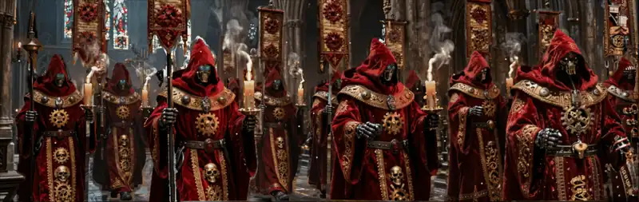
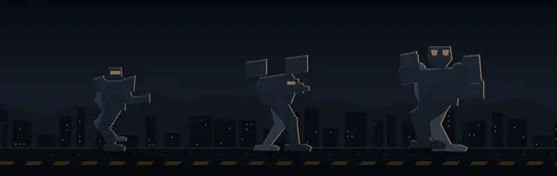
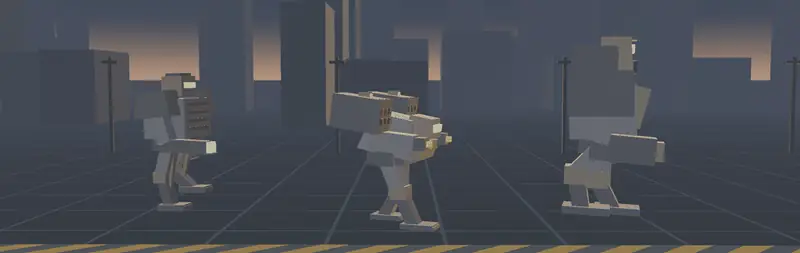
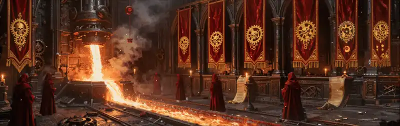

# funcraft

[](https://www.blender.org/)
[](https://www.python.org/)

Hobby animation projects: looping 19:6 banner animations rendered in Blender with Cycles on the GPU, and small self-contained web pages built from them. Scripts generate every scene, and every loop is exact: the frame after the last frame equals the first.



## Projects

The repository holds two scene projects with the same folder structure. Each has its own `README.md` (what it is and how to run it), `DESIGN.md` (how it is built) and `Makefile`.

| Project | Contents | Output |
|---|---|---|
| [`mech-design/`](mech-design/) | walking-machine banners, from hand-drawn 2D silhouettes to rigged high-poly meshes; the BEHEMOTH welcome page | 5 GIFs, 1 HTML page |
| [`w40k-mechanicum/`](w40k-mechanicum/) | a machine cathedral built in 3D, ten generated scenes with rigged figures, flames and smoke; a calendar of 366 daily entries; the sermon of the day page | 13 GIFs, 1 calendar, 1 HTML page |

### mech-design

Three walking machines cross a city in a 1140 × 360 banner. The project builds the same banner several times, from a flat 2D drawing to rendered 3D models.





- **2D** - silhouettes with a rim light, moved by two-bone inverse kinematics, drawn with Pillow only
- **Procedural 3D** - boxes, a perspective camera and a z-buffered software rasteriser, written without a 3D library
- **Models** - supplied meshes painted on the mesh, rigged with an armature and walked through a gait cycle in Blender; the camera jolts at each footfall
- **Loop check** - each generator renders one frame past the end and compares it with the first frame; the 2D banner and the procedural banner are pixel-identical, and the model banners differ by at most 8/255 in any pixel
- **Welcome page** - `make welcome` builds one HTML file of 0.47 MB with the banner as animated AVIF and the title font embedded, without JavaScript

### w40k-mechanicum

A machine cathedral in the style of the Adeptus Mechanicus, made with two pipelines that share textures, loop rules and GIF assembly.



- **Cathedral pipeline** - `src/mechanicum.py` builds a nave, shrines and an altar-machine in Blender from downloaded models, procedural geometry and generated textures
- **Plate pipeline** - one generated image gets depth from MoGe-2; every element that moves is cut out with SAM 2.1 and becomes its own mesh with bones; flames follow a model of the air and smoke is simulated as a gas
- **Textures** - embroidery, iron reliefs and stained glass come from Z-Image-Turbo; Latin text is written flat and draped on the surface that carries it
- **Calendar** - `calendar/` holds 366 short entries, one mock holy day per date, each teaching one point of machine learning, statistics or data science
- **Sermon page** - `make sermon` builds a package of 9.9 MB, `index.html` with a `resources` folder and the same files as a zip, that shows the entry of today's date with its service badge under one of seven banners, plays one music file and has three prayer buttons with a tune each. A visit transfers 10 of its 408 files. A download button gives the sermon with its badge as one image. A reader whose total of prayers reaches a holy number receives a seal and one of the 13 reward sermons of `rewards.md`; `SERMON.md` describes the rebuild and `design-sermons-html.md` the design

## Structure

Every scene project uses the same folders, and work moves through them in one direction.

```
funcraft/
├─ README.md
├─ .claude/              agent skills and the work journal
├─ mech-design/
│  ├─ README.md  DESIGN.md  Makefile
│  └─ src/  in/  resources/  wip/  out/
└─ w40k-mechanicum/
   ├─ README.md  DESIGN.md  SERMON.md  design-sermons-html.md  rewards.md  badges.md  Makefile
   ├─ calendar/
   └─ src/  in/  resources/  references/  wip/  out/
```

| Folder | Holds | In git |
|---|---|---|
| `src/` | the scripts that generate, build, render and assemble | yes |
| `in/` | inputs the scripts load: source meshes in `in/models/`, the files as received in `in/models/originals/` | no |
| `resources/` | material the scenes use: textures, logos and fonts | no |
| `references/` | reference material: target images, links, papers | text files only |
| `wip/` | work in progress: drafts, plates and depth, rendered frames, previews, logs, saved Blender scenes | no |
| `out/` | finished GIFs and pages, numbered in the order they were made | no |

`in/` and `references/` feed the scripts in `src/`, the scripts write to `wip/`, and a finished animation is assembled into `out/`. A generated texture starts as a draft in `wip/gen/`; the chosen draft becomes a file in `resources/assets/`.

## What a clone contains

Git tracks source and documents only. Inputs, resources, work in progress and outputs stay on the workstation, because together they hold several gigabytes of meshes, images and frames.

- **In the repository** - `src/`, the Makefiles, the Markdown documents, the calendar, `.claude/`, and the text files in `references/`
- **Not in the repository** - the downloaded models, the generated textures and plates, the rendered frames and the finished GIFs
- **To render a scene** - Blender 4.5 with a GPU for Cycles, Python with the packages named in the project README, and the models placed in `in/models/`

## Agent skills

`.claude/skills/` holds the rules an AI coding agent follows in this repository. Each rule comes from a result that was rejected and corrected.

| Skill | Covers |
|---|---|
| `design-blender` | building, painting, rigging and rendering scenes in headless Blender 4.5 |
| `design-gif` | exact loops, seam checks and GIF assembly |
| `design-w40k` | the grade, materials, embroidery and iconography of the cathedral scenes |
| `design-html` | self-contained pages: animated AVIF, embedded fonts, packed data, pages that work without scripts |

`.claude/JOURNAL.md` is the work log.

## Third-party material

This is an unofficial fan project. It is not affiliated with Games Workshop or Catalyst Game Labs, and their names and designs belong to them.

- **Models** - the downloaded models are not in the repository. `w40k-mechanicum/README.md` lists every model with its author and licence; most carry non-commercial Creative Commons licences
- **Mech meshes** - the three supplied meshes are fan-made models of existing chassis designs and are not in the repository. The 2D and procedural banners shown above use original geometry
- **Music** - the sermon page embeds four audio files of `resources/`; the files and the built page are not in the repository
- **Fonts** - the welcome page embeds Orbitron under the SIL Open Font License 1.1; the font file is not in the repository
