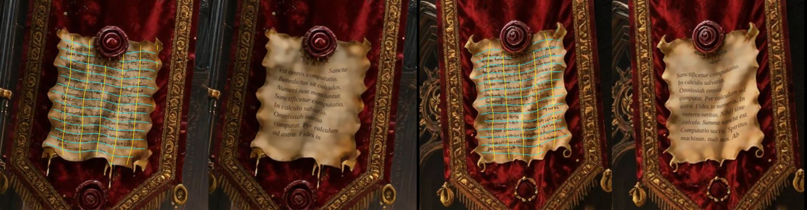
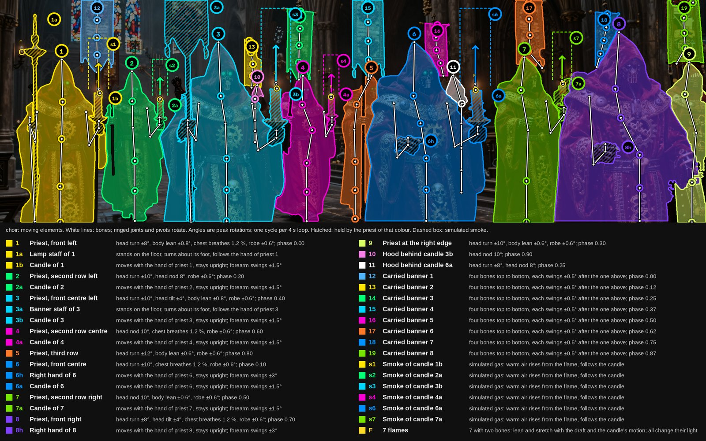
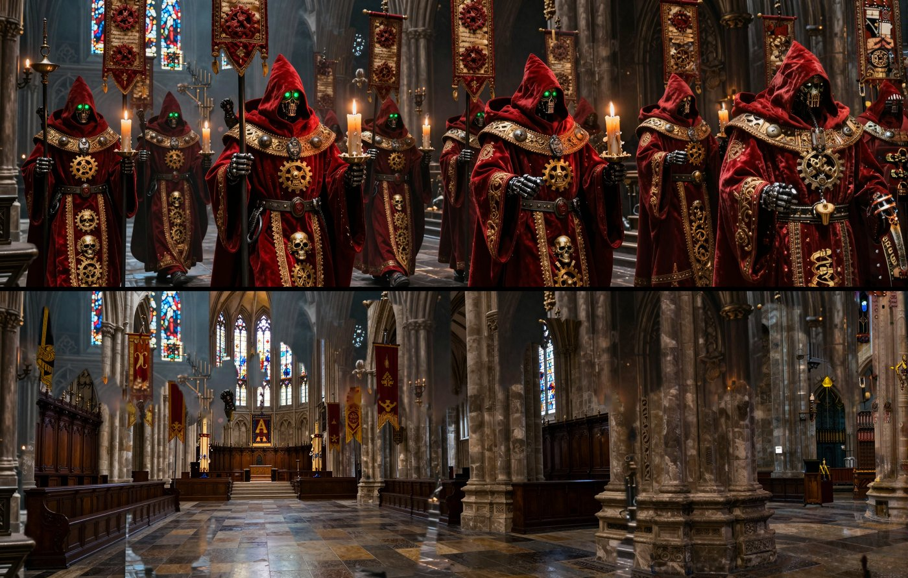
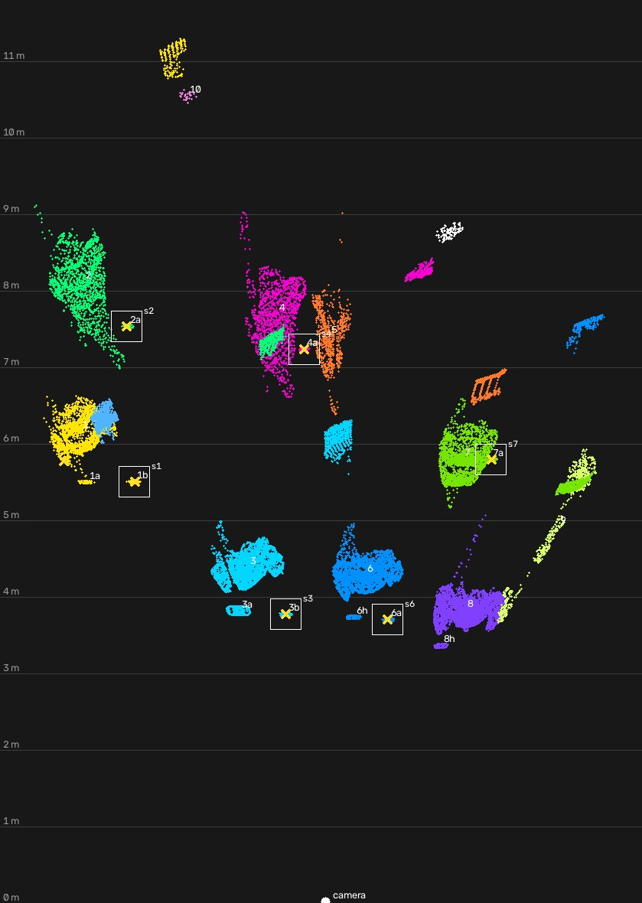
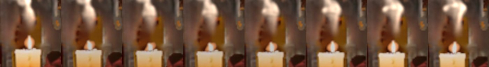
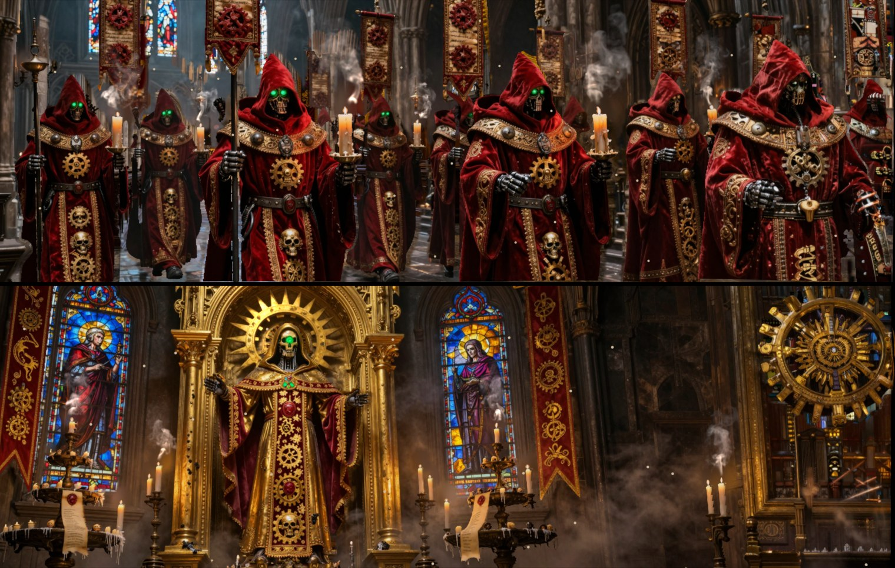

# w40k-mechanicum - Animation pipeline v1

Status: DRAFT for internal review, 2026-10-01.

## Contents

- [1. Overview](#1.-Overview)
  - [1.1 Pipeline diagram](#1.1-Pipeline-diagram)
  - [1.2 Outputs](#1.2-Outputs)
- [2. Image generation](#2.-Image-generation)
  - [2.1 Z-Image-Turbo](#2.1-Z-Image-Turbo)
  - [2.2 Textures](#2.2-Textures)
  - [2.3 Scene plates](#2.3-Scene-plates)
  - [2.4 Latin](#2.4-Latin)
  - [2.5 Text on surfaces](#2.5-Text-on-surfaces)
- [3. Depth from the image](#3.-Depth-from-the-image)
- [4. Cathedral scene](#4.-Cathedral-scene)
- [5. Plate scene animation](#5.-Plate-scene-animation)
  - [5.1 Motion map](#5.1-Motion-map)
  - [5.2 Segmentation](#5.2-Segmentation)
  - [5.3 Clean plate](#5.3-Clean-plate)
  - [5.4 Actors](#5.4-Actors)
  - [5.5 Placement rules](#5.5-Placement-rules)
  - [5.6 Air, flames and candle light](#5.6-Air,-flames-and-candle-light)
  - [5.7 Smoke](#5.7-Smoke)
  - [5.8 Wheels, cloth and streams](#5.8-Wheels,-cloth-and-streams)
  - [5.9 Plate effects and camera](#5.9-Plate-effects-and-camera)
  - [5.10 Checks before a render](#5.10-Checks-before-a-render)
- [6. Loop and timing](#6.-Loop-and-timing)
- [7. Rendering and assembly](#7.-Rendering-and-assembly)
- [8. Development workflow](#8.-Development-workflow)
- [9. Commands](#9.-Commands)

## 1. Overview

This document describes how the looping banner animations are made, from image generation to the finished GIF. The project has two pipelines that share the same textures, Latin, loop rules and GIF assembly.

- **Cathedral pipeline** - `src/mechanicum.py` builds a full 3D cathedral in Blender from downloaded models, procedural geometry and generated textures, and renders it from one of four camera positions
- **Plate pipeline** - one generated image (a plate) gets depth from MoGe-2. Every element that moves is cut out with SAM 2.1 and becomes its own mesh with bones in front of a plate painted without it. Flames follow a model of the air, smoke is simulated as a gas, and `src/scenes.py` renders the scene with a slow camera drift (section 5)
- **Shared final steps** - both pipelines render numbered PNG frames with Cycles on the GPU, and `src/assemble.py` turns the frames into a 1140 × 360 GIF that loops without a visible jump

### 1.1 Pipeline diagram

The diagram shows each step as the script that performs it, with image generation and depth estimation in purple and Blender in blue.

```mermaid
%%{init: {'themeVariables': {'fontSize': '8px'}, 'themeCSS': '.cluster-label span, .cluster-label text, .edgeLabel span {color:var(--jp-ui-font-color1, var(--vscode-editor-foreground, var(--fgColor-default, #1f2937))); fill:var(--jp-ui-font-color1, var(--vscode-editor-foreground, var(--fgColor-default, #1f2937)))} @media (prefers-color-scheme: dark){.cluster-label span, .cluster-label text, .edgeLabel span {color:var(--jp-ui-font-color1, var(--vscode-editor-foreground, var(--fgColor-default, #e5e7eb))); fill:var(--jp-ui-font-color1, var(--vscode-editor-foreground, var(--fgColor-default, #e5e7eb)))}}'}}%%
flowchart LR
    REF[(references/<br/>target images)]:::data
    subgraph GEN["Image generation"]
        direction TB
        TJ[gentextures.py<br/>texture prompts]:::data --> ZI[Z-Image-Turbo<br/>4 drafts each]:::ai
        PJ[genplates.py<br/>plate prompts]:::data --> ZI
        ZI --> AP[apply: cut-out,<br/>gold mask, stitched Latin]:::ingest
        ZI --> PK[pick: chosen plate]:::ingest
    end
    subgraph CAT["Cathedral pipeline"]
        direction TB
        MOD[(in/models/ via models.py<br/>paintfig.py)]:::data --> MEC[mechanicum.py<br/>nave, altar close-up]:::svc
        PIL[textures.py, emblem.py<br/>parchments, plaques]:::data --> MEC
    end
    subgraph PLT["Plate pipeline"]
        direction TB
        INS[inscribe.py<br/>Latin draped on sheets]:::ai --> MG[img2geometry.py<br/>MoGe-2 depth]:::ai
        MM[motion.py<br/>motion map]:::data --> SG[segment.py<br/>SAM 2.1 masks, flames]:::ai
        MG --> SG
        SG --> CP[cleanplate.py<br/>scene without actors]:::ai
        CP --> BD[backdrop.py<br/>depth mesh, camera]:::svc --> SC[scenes.py<br/>actors, flames, smoke, drift]:::svc
        SG --> AC[actors.py, rig.py<br/>meshes and bones]:::svc --> SC
        AC --> SM[smoke.py<br/>gas simulation]:::svc --> SC
    end
    REF --> TJ
    REF --> PJ
    AP --> MEC
    PK --> INS
    MEC --> FR[(wip/frames-*<br/>PNG + seam check)]:::data
    SC --> FR
    FR --> AS[assemble.py]:::svc --> GIF[out/NN-name.gif]:::act
    classDef data fill:#FFFFFF,stroke:#6B7280,color:#111,font-size:9px
    classDef ingest fill:#0EA5E9,stroke:#0369A1,color:#fff,font-size:9px
    classDef svc fill:#3B82F6,stroke:#2563EB,color:#fff,font-size:9px
    classDef ai fill:#A855F7,stroke:#7E22CE,color:#fff,font-size:9px
    classDef act fill:#10B981,stroke:#047857,color:#fff,font-size:9px
    style GEN fill:none,stroke:#6b7280,stroke-width:3px
    style CAT fill:none,stroke:#6b7280,stroke-width:3px
    style PLT fill:none,stroke:#6b7280,stroke-width:3px
    linkStyle default stroke-width:2.3px
```

*Fig 1 - From reference images to the finished GIF, by script*

### 1.2 Outputs

The finished animations are in `out/`, numbered in the order they were made.

| File | Pipeline | Content | Loop |
|---|---|---|---|
| `01-mechanicum.gif` | cathedral | first nave version | 40 frames, 2 s |
| `02-mechanicum.gif` | cathedral | nave with congregation, priests, banners | 40 frames, 2 s |
| `03-mechanicum-altar.gif` | cathedral | altar close-up with the near servitor | 40 frames, 2 s |
| `04-forge.gif` … `08-hall.gif` | plate | forge, vault, street, saint, hall | 80 frames, 4 s |
| `09-reliquary.gif` … `13-voidshrine.gif` | plate | reliquary, foundry, scriptorium, choir, voidshrine | 80 frames, 4 s |

## 2. Image generation

This section covers how the texture images and the scene plates are generated, and how exact Latin is added to them. One model generates all of them, Z-Image-Turbo, and scripts write every Latin word.

### 2.1 Z-Image-Turbo

Z-Image-Turbo is an open text-to-image model from Tongyi-MAI (Alibaba Tongyi Lab), released in November 2025 under Apache-2.0.

- **Size** - 6 billion parameters in one transformer that reads text tokens and image tokens as one sequence
- **Text encoder** - a Qwen3 language model of about 4 billion parameters
- **Speed** - "Turbo" is a distilled version that needs 8 steps; this project uses 9 steps, guidance scale 0, about 4 s per image on the RTX PRO 6000
- **Runtime** - diffusers `ZImagePipeline` in the venv `.venv-moge`; the weights take 31 GB in the Hugging Face cache
- **Limit** - the model misspells Latin (CALCILUM for CALCULUM, LAUDETTUR, SALVATO), so no generated Latin is used unchecked

### 2.2 Textures

`src/gentextures.py` generates the fabric, metal, glass and surface textures of the cathedral pipeline.

- **Prompts** - `JOBS` holds one prompt and size per texture: antependium, drape, six banners, two hangings, twelve plaques, three reliefs, three stained glass windows and four surface swatches (steel, brass, skin, wool)
- **Style suffixes** - `STYLE` (worn velvet and goldwork), `METAL` (blackened iron) and `GLASS` (leaded glass) describe the wear and ask for a flat frontal view with even light
- **Drafts** - `gen <stem>` writes four seeds per texture to `wip/gen/<stem>_<seed>.png`; a person chooses one draft per texture in `CHOICES` after reading every Latin word
- **Apply** - `apply all` removes the studio background around a textile (flood fill of pale, unsaturated pixels from the border), writes `resources/assets/<stem>.png` and a gold mask `resources/assets/<stem>_gold.png` (hue 22° to 60°, saturation above 0.25, value above 0.30)
- **Use** - the gold mask makes the thread metallic, glossy and raised in the Blender material `embroidered()`

### 2.3 Scene plates

`src/genplates.py` generates the images of the plate pipeline.

- **Size** - 2432 × 768 pixels, the 19:6 shape of the banner, so the plate fills the frame without cropping
- **Prompts** - one scene description per plate in `PLATES`, each followed by the shared `PLATE` suffix: carved and embroidered surfaces, crimson velvet with gold, purity seals, soot and wax, low-key light
- **Drafts** - `gen all 1 2 3 4` writes four drafts per plate; a person chooses one per plate in `PICKS`
- **Pick** - `pick all` copies each chosen draft to `wip/scene3d/<name>.png`; `src/inscribe.py` then writes the Latin on its parchments and book pages (section 2.4)

### 2.4 Latin

Every readable Latin word comes from a script. The prayers are about sanctified calculation (`SANCTA` in `gentextures.py`: SANCTA EST OMNIS COMPUTATIO, NUMERI NON MENTIUNTUR, IN CALCULO SALVATIO and others).

- **Stitched Latin** - `stitch()` fills the plain velvet between motto and fringe of the banners and the drape with gold lettering: satin ridges, a dark couching cord at the edges, a shadow on the pile, tarnish and worn stitches, written into the gold mask as well
- **Parchments and book pages on plates** - `src/inscribe.py` writes the prayer as a flat texture and drapes it on each sheet listed in `PARCHMENTS` and `PAGES` (section 2.5)
- **Purity seals and plaques** - `src/textures.py` draws the parchment strips (`parchment()`, the `LITANY` lines) and the plaques in PIL
- **Motto rule** - where a generated motto must stay, it uses words the model spells: AVE OMNISSIAH, DEUS IN MACHINA, OMNISSIAH VULT, IN CALCULO SALVATIO

### 2.5 Text on surfaces

This section states the rule for every text or decoration that lies on an object in a plate, and how `src/inscribe.py` applies it to parchments and book pages. The text is written as a flat texture and draped on the shape of the object; it is never placed in the image directly.

- **Rule** - the texture follows the shape the picture shows: it bends where the surface bends, shortens where the surface turns away, and waves where the sheet is warped
- **Shape evidence** - two sources, used together: the measured surface (normals and depth) and the outline of the object. A sheet is cut straight, so a wavy edge on the flat chart is warp that the measurement did not resolve
- **Plane text** - allowed only where both sources show a plane: no bend in the surface and straight edges
- **Proof** - `wip/preview/sheets-<name>.png` draws the chart on every sheet beside the result. Grid lines that stay straight on a sheet drawn warped mean the drape failed. Every sheet is checked: one accepted sheet does not prove the others

The two cases that set the rule:

| Sheets | Surface bend | Edge waves | Drape by the surface alone | Drape by surface and edges |
|---|---:|---:|---|---|
| Scriptorium book pages | 16 to 35 degrees | none, the page region is set by hand | accepted: the measured surface carries the bend | the same picture |
| Street banner parchments | 4 to 8 degrees | 2 to 6 px | rejected: the measured surface is a plane, so the text is a straight block | accepted: the lines wave with the sheet |

*Fig 2 - Street parchments: the chart drawn on each sheet (cyan lines are text lines) beside the draped Latin*

`src/inscribe.py` works on one sheet at a time:

1. **Sheet** - SAM 2.1 cuts the whole sheet from five points inside its box in `PARCHMENTS`; the box frames only the written part and would hide the edges. A colour test removes the wax seals. A book page is the quad given in `PAGES`
2. **Surface** - MoGe-2 measures an enlarged crop round the sheet, because on the whole plate a sheet comes out as one flat plane. The depth of every pixel is then solved from the normals by least squares, held loosely to the measured depth
3. **Chart** - a least squares conformal map lays the surface flat: every pixel of the sheet gets a place (u, v) in metres. The chart is turned so that u runs along the lines of the script the model wrote
4. **Edge waves** - `waves()` measures how far each of the four edges of the flat sheet leaves a straight line and carries that wave into the chart, each edge's wave at its own side and a mix between. Notches deeper than 8 % of the sheet's size (a seal over the edge, a torn corner) are bridged. The wave is smoothed until it leans no letter by more than 19 degrees
5. **Texture** - the generated script is removed stroke by stroke, each stroke taking the tone of the sheet beside it, so stains and shading stay. The prayer is written straight on the flat sheet in brown ink with a red initial for every fourth phrase, inside the largest rectangle the sheet holds; seals and marks split its lines
6. **Drape** - every pixel takes the texture's value at its (u, v); the ink darkens the sheet, so the sheet's shading lies on the text as well
7. **Check** - the log line of each sheet gives its bend and its edge waves; the check picture shows the chart. A sheet with room for fewer than 8 words keeps the generated script

## 3. Depth from the image

This section covers how a flat plate becomes a 3D surface that a moving camera can look at.

- **Estimation** - `src/img2geometry.py` runs MoGe-2 (Microsoft, MIT licence, model `Ruicheng/moge-2-vitl-normal`) on GPU and saves `wip/scene3d/<name>.npz`: a metric point map, depth, normals, a validity mask and the camera intrinsics
- **Fill layer** - the script also saves the depth pushed out from every depth break (`bg_depth`, the farthest depth within 25 pixels) and `<name>_bg.png`, the image with the near side of each break inpainted
- **Mesh** - `src/backdrop.py` builds one vertex per 2 pixels and leaves out quads that span a depth break (far corner deeper than 1.25 × near corner); the fill layer sits 1 % behind it and shows only where the front layer has a gap
- **Sky** - pixels MoGe-2 leaves out become a far surface at twice the farthest depth
- **Camera** - a camera with the image's field of view and principal point reproduces the plate exactly from the origin
- **Limit** - camera moves up to about 8 cm show clean parallax; 25 cm and more stretch the image at depth breaks

## 4. Cathedral scene

This section covers the fully 3D pipeline in `src/mechanicum.py`. The detailed look rules are in the project skill `design-w40k`.

- **Shots** - `-- shot=<name>` selects a camera: the full nave (no shot), `offering`, `looming` and `altar`; close-up changes sit under `if SHOT:` in `materials()`, `lights()`, `atmosphere()`, `render_setup()` and `figures()`
- **Models** - `src/models.py` loads the downloaded models in `in/models/originals/` (each with `SOURCE.txt`; licences in `README.md`), joins, turns and scales them
- **Figures painted by part** - `src/paintfig.py` gives each face of a sculpt a class (skin, cloth, machine, leather, brass, rubber) from rules on face position and normal; `painted()` assigns one material per class
- **Materials** - distressed gold, absorbent velvet, embroidered textiles from section 2.2, box-projected relief panels, photographic surface swatches with corrosion, and `weather()` for soot, grime and dust on every close-up material
- **Iconography** - the Cog Mechanicum medallion painted in its seven parts, purity seals, candle clusters with wax drips, coolant tubes, curtains and hangings
- **Light** - candles, the relic beam and spots that shine through a leaded window pattern made in the light's own node tree (`window_light()`), so no window geometry appears in frame
- **Grade** - close-ups use AgX with the Punchy look at exposure -0.15 and haze density 0.005; the nave keeps its own grade

## 5. Plate scene animation

This section covers how a still plate becomes a scene whose elements move: which elements move, how they are cut out, what stands behind them, how they are rigged, where they are placed, and how flames, light, smoke and the remaining effects are made. `src/build-scene.sh` runs the steps in the order of the table; `src/scenes.py` renders the result.

| Step | Script | Result | Check |
|---|---|---|---|
| Motion map | `src/motion.py` (`MAPS`) | every moving element with its kind, box, points and motion | `wip/preview/motion-<name>.png` |
| Masks | `src/segment.py cut` | one mask per element, `<name>_sam.npz` | the masks drawn on the motion map |
| Painted smoke out | `src/cleanplate.py <name> desmoke` | the plate without painted wisps | `wip/gen/plate_<name>_smoky.png` keeps the original |
| Flames | `src/segment.py flames` | flames with wick, tip, owner and mask, `<name>_seg.npz` | every flame marked F on the motion map |
| Clean plate | `src/cleanplate.py <name> <seed>` | the scene without its actors, with depth | drafts `wip/gen/clean_<name>_s<seed>.png` |
| Actors | `src/actors.py` | meshes, weights and bones, `<name>_actors.npz` | skeletons drawn on the motion map |
| Molten flow | `src/motion.py flow` | 80 clean plates with flowing streams | - |
| Smoke sources | `scenes.py -- <name> sources` | the path of every smoke source through the loop | - |
| Smoke | `src/smoke.py` | density per loop frame, `wip/sim/<name>/<source>.npz` | `wip/preview/smoke-test.png` |
| Placement | `src/motion.py plan` | top view and table of depths | `wip/preview/plan-<name>.png`, `FLAG` lines |

### 5.1 Motion map

This section covers how the moving elements of a plate are found and written down. A person reads the plate and lists every element that moves in `MAPS` of `src/motion.py`; the list is the single source for masks, meshes, bones and motions.

- **Discovery** - `segment.py detect <name> "<prompt>"` runs Grounding DINO for a text prompt and draws its boxes. On the whole 19:6 plate it finds little, so it runs on five overlapping square tiles and the boxes are merged. Small items it misses are boxed by hand
- **Entry** - each element has an id, a name, a box, one or more points inside it (and points that must stay outside), a phase, and the numbers of its motion
- **Whole cycles** - every motion makes a whole number of cycles per loop, so frame 80 equals frame 0. Phases differ between elements, so they do not move together
- **Review** - `motion.py map <name>` draws every mask in its own colour, the bones, each flame as F, each smoke box, and a legend that states the motion of each element in plain words. The owner reviews this picture before anything is built

| Kind | Element | Motion |
|---|---|---|
| `priest` | a figure | head turn, nod and tilt, body lean, chest breathing, robe swing that lags the body |
| `carry` | a thing in a hand, or a free hand | moves with the hand and stays upright; a staff on the floor turns about its foot |
| `spin` | a wheel, cog or fan | whole turns per loop about its axis, or a rocking of a few degrees |
| `swing` | a hanging thing | swings about its pivot |
| `hover` | a floating thing | rises and sinks |
| `cloth` | a banner or drape | four bones from the top edge down, each swinging after the one above |
| `stream` | molten metal, fire | the texture flows along a line; the element stays in the plate |
| `smoke` | a smoke source | simulated gas from a carried candle's flame or from a fixed point |

*Fig 3 - Motion map of the choir: masks, bones, flames (F), smoke boxes and the legend of every motion*

### 5.2 Segmentation

This section covers how each element gets its mask. SAM 2.1 (`facebook/sam2.1-hiera-large`) cuts every element on a crop round its box, so a small far figure is cut at full plate resolution.

- **Prompt** - the box of the element plus its points; a thing held in a hand is cut together with the hand that holds it (`grip`), so thing and hand move as one
- **Tidy** - gaps up to 7 px are closed, pieces under 5 % of the largest are dropped, every carried piece leaves its priest's mask, and a pixel claimed by two masks goes to the element whose depth is nearest. Holes in cloth are filled, so a seal pinned on a banner belongs to the banner
- **Flames** - a flame is a white-hot core with an orange ring, not wider than tall, at least 0.3 of the size a 1.2 × 3 cm flame has at that depth, not beside blue (stained glass), and on a candle: inside a Grounding DINO "candle" box or on a carried candle. A white spot on a figure is a highlight. `NOFLAME` boxes exclude molten metal; `FLAMES` boxes force a lamp flame behind glass
- **Flame base** - flame and candle top are often one bright blob. `flame_base()` reads the blob's width row by row from the tip: the candle begins where a row is more than 1.5 times as wide as the four rows above it, where the blob widens by 3 px after it has narrowed from its belly, or, for a blob that ends at its widest, where its lower third becomes 1.8 times wider than its upper part. A fixed width limit cut tall flames at their belly
- **Flame element** - every flame gets a mask of its own and leaves the mask of its candle; it records its wick, its tip and the candle that carries it
- **Lamp flames** - a flame in a `FLAMES` box burns behind glass, where no draft reaches it. It stays painted and gives light only
- **Flames at the plate's edge** - a flame whose candle is below the plate ends at the edge and keeps its painted size, because its full height is not known

### 5.3 Clean plate

This section covers what stands behind the actors. When an actor moves it uncovers what was behind it, so the scene is painted once more without any actor.

- **Hole** - the masks of all actors and of the flames on carried candles together, grown by 12 px to take the rim light too
- **Paint** - Z-Image-Turbo's inpainting pipeline fills the hole from a prompt that describes the empty scene (`EMPTY`). Several seeds are drafted; the chosen seed per scene is in `CLEAN_SEED` of `src/motion.py`
- **Depth** - MoGe-2 measures the clean plate; its depth is scaled to the original on the pixels both share and replaces the original inside the hole
- **Behind every actor** - the painted scene may put a pillar where a priest stands. The backdrop is therefore pushed behind the back of every actor
- **Sky** - pixels without depth go to a far dome
- **Painted smoke** - a wisp painted into the plate would stay in place when its candle moves, and lies at the background's depth. `desmoke` paints it over inside the boxes of `WISPS`; the smoke returns simulated (section 5.7)
- **Streams stay** - molten streams are not in the hole, and the prompt does not name them, so the paint adds no new glow
- **Standing candles stay** - the flame of a candle that stands in the scene is not in the hole: the paint would remove the candle with it. `unflame()` takes the flame out of the clean plate locally. It fills the flame from its rim, then replaces the soft tone within 0.7 flame heights of the flame by the tone 1.5 heights out, mixes the two in between, and keeps the detail drawn there except close to the flame, where the detail is the flame's own bright rim. The candle under the wick and the candles beside it are left as painted (`candle_under()`). The paint itself is kept in `<name>_paint.png`, so this step can run again without a new paint. MoGe-2 measures the picture after this step, and where a flame was that depth is used: the first plate's depth there is the candle's, which left a patch of wall hanging in the air at the candle's depth Without this step the bloom of the large painted flame hangs round the small flame as a halo. The same step runs where a carried candle's flame was: there the paint tends to leave a bright patch

*Fig 4 - The choir plate (top) and its clean plate (bottom), the scene painted without its actors*

### 5.4 Actors

This section covers how an element becomes a mesh that bones move. `src/actors.py` bakes meshes, weights and bones outside Blender (Blender's Python has no OpenCV); `src/rig.py` builds the armatures from that file.

- **Mesh** - one vertex per 2 plate pixels on the MoGe-2 points inside the mask. The depth is smoothed from the mask's interior, because edge pixels blend into the background. The rim curves back and a back shell closes the mesh. UVs are plate pixels: the plate is the texture
- **Thin things** - a candle, a staff or a chain takes one depth, the near side of what MoGe-2 saw
- **Skeleton** - by kind, see the table. Bones are placed from landmarks of the mask (top, neck, chest, hips, feet, hand)
- **Weights** - smooth bands along the mask: head above the neck, chest and spine below, two robe bones under the hips, forearm and upper arm inside a band round the arm line
- **Motion** - rotations of bones as sines with whole cycles per loop; the robe and each cloth bone follow the bone above with a delay

| Kind | Bones |
|---|---|
| `priest` | root, spine, chest, head; two robe bones from the hips; per hand an upper arm, a forearm and a hand bone that keeps its orientation |
| `carry` | bound to its priest's hand bone; a standing staff has a bone from its foot that tracks the hand |
| `swing`, `hover`, `spin` | one bone: from the pivot, through the centre, along the axis |
| `cloth` | four bones from the top edge down |
| `flame` | two bones from the wick up; on a carried candle they hang from the hand bone |

### 5.5 Placement rules

This section lists the rules that put every element at its place in depth, and the check that proves them. Depth from one image is wrong often enough that each rule exists because a render showed the fault.

| Rule | Reason | Value |
|---|---|---|
| A held thing lies within an arm's reach of its priest's chest | MoGe-2 put a candle 1.07 m in front of the chest; the hand then swung it on another radius than the hand | `REACH` 0.65 m |
| A held thing is bound to a hand bone that keeps its orientation | a candle must stay upright when the forearm turns | - |
| A hand that holds a thing is cut with the thing | the candle moved and the hand did not | `grip` |
| A smoke source is the tip of its flame, and moves with it | smoke must not rise metres behind its candle | distance under 5 cm |
| The backdrop lies behind the back of every actor | a painted pillar hid a priest | - |
| A flame is shown at the size of a candle flame, about its wick | the model paints flames 4 to 26 cm tall | `FLAME_H` 4 cm, at least `FLAME_PX` 8 plate pixels |
| A thin thing takes one depth | its pixels mix with the background | 30th percentile |

- **Check** - `motion.py plan <name>` draws the scene from above (actors, flames, smoke boxes) and prints two tables: each held thing's depth against its priest's chest, and each smoke source's distance from its flame
- **Flags** - a held thing more than 0.8 m from the chest, or a smoke source more than 5 cm from its flame, prints `FLAG`. A build with a flag is not rendered

*Fig 5 - The choir from above: actors by colour, flames as crosses, the box of air of each smoke source*

### 5.6 Air, flames and candle light

This section covers the model that moves the flames and their light. `src/air.py` gives the air of the scene; flames and smoke both read it.

- **Draft** - a sum of travelling waves with 1 to 7 whole cycles per loop and wavelengths of 1.5 to 5 m, 0.10 m/s in strength. Flames a metre apart get different air
- **Gusts** - a flame also feels fast, small eddies: 4 to 27 cycles per loop (1 to 6.75 Hz), wavelengths of 0.3 to 1.2 m, 0.35 m/s, amplitude falling with frequency as f^(-5/6). With the draft they lean a flame by 16 degrees on average and 38 at most, and change the lean by 6.5 degrees from frame to frame
- **Lean** - the flame gas rises at about 1 m/s. Air crossing it at speed v leans it by atan(v / 1 m/s); the wind a flame feels is the air less the candle's own velocity, so a moving candle's flame trails
- **Length and light** - an updraft stretches the flame and gives more light, a crosswind shortens it and gives less. A stretched flame is drawn thinner
- **Flame element** - a flame is light, not a thing with an edge. It is drawn from the plate through an alpha that keeps bright, warm pixels only; the glow the model painted round it stays out
- **Candle light** - every material is multiplied by (1 + Σ I s) / (1 + Σ s), summed over the flames: I is the flame's light relative to still air, s = R² / (R² + d²) its share at distance d, R = 0.5 m, and the 1 is the scene's own light. The factor stays between the smallest and the largest I, however many flames stand together; the earlier form 1 + Σ (I - 1) s turned the candles of a cluster dark. Flames move with their candles. No shadows

*Fig 6 - One candle flame of the choir in eight consecutive frames (50 ms apart)*

### 5.7 Smoke

This section covers the smoke of candles and censers. `src/smoke.py` simulates each source as a gas in its own box of air and the renderer shows the result as a volume at the place of the source.

| Property | Value |
|---|---|
| Equations | incompressible Navier-Stokes with Boussinesq buoyancy, temperature as a second field |
| Box | 0.4 × 0.4 × 0.8 m, 64 × 64 × 128 cells of 6.25 mm |
| Numerics | MacCormack advection with a limiter; viscosity and pressure projection in Fourier space; vorticity confinement |
| Source | 45 K above the room at the wick; the warm air mixes away in 3 s |
| Room | the draft of section 5.6 plus weak eddies of 8 to 20 cm |
| Smoke | 3000 particles per frame, carried by the air, counted into cells of 3.1 mm |
| Visibility | a particle shows from the age of 0.10 s and fully from 0.45 s, and fades out by 4.5 s |
| Loop | 240 warm-up frames, then two records of 80 frames, cross-faded so that frame 80 equals frame 0 |
| Cost | about 12 s per source on one GPU |

- **Why particles** - particles keep a filament thin where a grid field would blur it
- **Why smoke shows late** - the gas that leaves a flame is hot and clear; its soot shows a few centimetres higher. Without this the densest smoke sits on the flame tip and reads as a larger, whiter flame
- **Render** - one OpenVDB file per loop frame. The volume emits and absorbs; it does not scatter. A scattering volume needs light sampling, and the denoiser turned its noise into flicker
- **Light on the smoke** - the plate's own light behind it (the plate blurred by 40 pixels, looked up by screen position) plus the candle flames within about 12 cm, at half the weight of the light behind, so smoke over a flame does not turn white

### 5.8 Wheels, cloth and streams

This section covers the remaining kinds of motion.

- **Wheels** - a wheel that spins is a flat disc on the plane fitted to its points, with its texture unrolled by angle and radius and an alpha for its shape, so it can turn all the way. A large wheel takes its axis from the fitted plane; a small whole wheel seen at an angle takes it from the ellipse of its mask; any other faces the camera
- **Fans** - `rim="inner"`: only the largest filled circle inside the mask turns, the frame stays in the plate
- **Cloth and robes** - a chain of bones from the top edge; each bone swings a fraction of a degree after the one above
- **Streams** - the texture of a molten stream is carried along its flow line in two copies half a cycle apart, cross-faded, 4 cycles per loop. The result is written as one clean plate per loop frame

### 5.9 Plate effects and camera

This section covers the effects that work on the plate's own pixels.

- **Plate material** - backdrop and actors are emission shaders that show the plate, multiplied by the candle light
- **Status lights and screens** - small bright green lights are divided into 6-pixel cells; each cell switches off at random once per tick (16 frames). A green light with more than 42 pixels in a 13-pixel square is no status light and stays whole: a screen, a beam, a pair of glowing eyes
- **Halo glint** - for the saint plate, gold pixels inside the halo brighten in a narrow band that travels round the halo once per loop
- **Dust** - 36 small emissive motes near the lens, each on its own closed path
- **Servo-skull** - a scene may hold a floating servo-skull (`skull` in `SCENES`, built by `src/servoskull.py`). It is the downloaded model, not a picture: a servo-skull painted into the plate by the image model was rejected as not a proper servo-skull
  - **Paint** - the model's 117 loose pieces get a material by shape: the piece with the most vertices and the teeth are bone, tubes are rubber, fittings on the face are brass, the rest is iron; a disc that only emits red sits in the mouth of the ocular, the piece that reaches furthest forward: three times full red in a core of a quarter of its radius, dark red at the rim. A lit, glossy disc came out pale orange
  - **Light** - the skull is the one surface in a plate scene that needs light: a warm point light where the scene has one, a cold one behind it, and a weak light from all round. The emitting plate is hidden from the skull's rays and left out of the light sampling; with it the skull came out speckled at 64 samples
  - **Motion** - it rises and sinks 1.2 cm, drifts 0.8 cm sideways and turns 4 to 5 degrees, once per loop
- **Camera** - a closed path of 0.8 % of the nearest scene depth (2 to 6 cm) gives parallax

### 5.10 Checks before a render

This section lists what is looked at before a scene is rendered in full, in order. Nothing is rendered in full before the owner has seen the test frames.

1. **Motion map** - `wip/preview/motion-<name>.png`: every mask, bone, flame and smoke box
2. **Text** - `wip/preview/sheets-<name>.png`: the chart of every sheet (section 2.5)
3. **Placement** - `wip/preview/plan-<name>.png` and the two tables; no `FLAG`
4. **Test frames** - `scenes.py -- <name> 0 20 40 60`: four frames spread over the loop; `src/build-scenes.sh` builds scenes one after another and renders these four frames of each
5. **Full render** - 80 frames; then the seam (frame 80 against frame 0), the mean change between neighbouring frames, and `motion.py proof <name>`, which measures each element's motion in the frames by optical flow

*Fig 7 - Test frame 20 of the choir (top) and of the saint scene (bottom)*

## 6. Loop and timing

This section covers how every animation returns exactly to its first frame.

| Pipeline | Frames | Frame time | Loop | Tick |
|---|---:|---:|---:|---:|
| cathedral, nave | 40 | 50 ms | 2 s | 4 frames |
| cathedral, close-ups | 40 | 50 ms | 2 s | 8 frames |
| plate scenes | 80 | 50 ms | 4 s | 16 frames |

- **Clocks** - every animated value is a function of `phase` in [0, 1) or of `tick`, an integer that changes every tick frames; `CLOCKS` holds the shader nodes that receive them and `MOVERS` the functions that pose objects
- **Whole cycles** - everything completes whole cycles per loop: a fan turns by a multiple of its blade spacing, a banner swings once, a light changes state per tick
- **Looping noise** - a noise that changes over time takes its fourth dimension and one axis from a circle of radius r at angle 2π × phase, so phase 1.0 gives the same value as phase 0.0; a larger r changes faster
- **Seam check** - each render also writes the frame at phase 1.0 as `seam-check.png`; it must equal `f000.png` (measured mean difference 0.0 to 0.008 of 255)

## 7. Rendering and assembly

This section covers the render settings, the machines and the GIF step.

| Step | Samples | Time per frame | GPU |
|---|---:|---:|---|
| cathedral preview | 24 | about 40 s per still with scene build | RTX PRO 6000 |
| cathedral close-up frame | 128 | about 40 s | RTX PRO 6000 |
| plate preview | 24 | about 3 s | RTX 5000 Ada |
| plate frame | 64 | about 4.4 s | RTX 5000 Ada |

- **Engine** - Blender 4.5.9, Cycles on CUDA; the GPU is chosen by the nvidia-smi index in `CUDA_VISIBLE_DEVICES` (1 is the RTX PRO 6000, 2 is the RTX 5000 Ada)
- **Stopping a GPU job** - a job that uses a GPU is not killed while it runs. On this workstation (WSL2) three build steps killed at once left a thread waiting in the GPU driver, and every program that opened a GPU afterwards waited behind it for 24 minutes. To stop a queue, stop its shell script and let the running step end
- **Detached renders** - long renders run under `nohup setsid`, log to `wip/logs/`, and write each frame to disk as it finishes; `src/render-scenes.sh <gpu> <first GIF number> <scene>...` renders plate scenes one after another and assembles each GIF
- **Assembly** - `src/assemble.py <frames> <gif>` resizes each frame to 1140 × 360, builds a palette of 224 colours from the first frame by median cut, adds up to 32 colours for the pixels of every tenth frame that lie further than 40 (of 255) from that palette, dithers every frame with Floyd-Steinberg, and writes 50 ms per frame, looping forever. A median cut gives colours by pixel count: without the added colours the servo-skull's red eye lens, about 100 pixels, came out brick red
- **Size** - cathedral GIFs are about 10 MB for 40 frames; the plate GIFs of 80 frames are 22 to 26 MB
- **Render time** - a plate scene of 80 frames takes about 4 minutes on the RTX PRO 6000 or the RTX 5000 Ada; ten scenes on three GPUs took 21 minutes

## 8. Development workflow

This section lists the order of work for a new scene. Each step has a check, and nothing is rendered in full before a preview is approved.

1. **Reference** - add the target images to `references/`; measure luminance percentiles and the share of crimson pixels, the numbers a render is later compared with
2. **Generate** - write the prompt, generate four drafts, read every Latin word, choose one draft
3. **Build** - for a plate: `pick`, then `inscribe.py` with a look at the chart of every sheet (section 2.5), then MoGe-2, then an entry in `SCENES`; for the cathedral: code in `mechanicum.py`
4. **Preview** - render one still at 24 samples (`-- <name> preview`) and compare it side by side with the reference crop
5. **Approve** - the owner approves the preview; changes return to step 2 or 3
6. **Render** - the full loop, detached, with its log
7. **Check** - compare `seam-check.png` with `f000.png`, look at the difference between neighbouring frames for noise or flicker, and view the GIF at its real size before delivery

## 9. Commands

This section lists the commands for each step, run from the project folder.

| Step | Command |
|---|---|
| texture drafts | `CUDA_DEVICE_ORDER=PCI_BUS_ID CUDA_VISIBLE_DEVICES=1 .venv-moge/bin/python src/gentextures.py gen <stem\|all>` |
| apply chosen textures | `.venv-moge/bin/python src/gentextures.py apply all` |
| plate drafts | `CUDA_DEVICE_ORDER=PCI_BUS_ID CUDA_VISIBLE_DEVICES=2 .venv-moge/bin/python src/genplates.py gen <name\|all> 1 2 3 4` |
| chosen plates | `.venv-moge/bin/python src/genplates.py pick all` |
| Latin on sheets | `CUDA_DEVICE_ORDER=PCI_BUS_ID CUDA_VISIBLE_DEVICES=1 .venv-moge/bin/python src/inscribe.py <name>` |
| depth | `CUDA_DEVICE_ORDER=PCI_BUS_ID CUDA_VISIBLE_DEVICES=2 .venv-moge/bin/python src/img2geometry.py wip/scene3d/<name>.png` |
| cathedral preview | `CUDA_VISIBLE_DEVICES=1 blender -b -P src/mechanicum.py -- shot=altar preview` |
| cathedral frames | `CUDA_VISIBLE_DEVICES=1 blender -b -P src/mechanicum.py -- shot=altar` |
| moving elements found by prompt | `.venv-moge/bin/python src/segment.py detect <name> "hooded priest" "candle"` |
| build a plate scene (masks to smoke) | `src/build-scene.sh <gpu> <name> [clean-plate seed]` |
| build scenes and render four test frames of each | `nohup setsid src/build-scenes.sh <gpu> <name>...` |
| motion map, placement check | `python3 src/motion.py map <name>`, `python3 src/motion.py plan <name>` |
| plate test frames | `CUDA_VISIBLE_DEVICES=2 blender -b -P src/scenes.py -- <name> 0 20 40 60` |
| plate preview | `CUDA_VISIBLE_DEVICES=2 blender -b -P src/scenes.py -- <name> preview` |
| measured motion in the frames | `python3 src/motion.py proof <name>` |
| plate frames and GIFs | `nohup setsid src/render-scenes.sh <gpu> <first GIF number> <name>...` |
| GIF | `python3 src/assemble.py wip/frames-<name> out/<NN>-<name>.gif` |

`blender` is `~/.local/opt/blender-4.5.9-linux-x64/blender`. The venv `.venv-moge` has Python 3.12, torch 2.14 with CUDA 13.2, diffusers 0.41 (development build) and MoGe.
