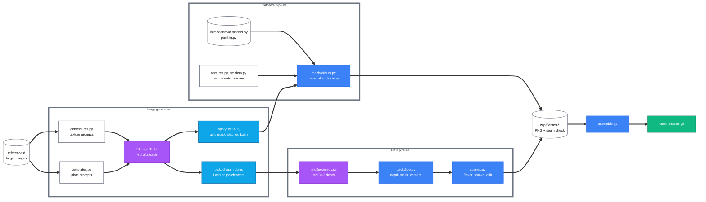

# w40k-mechanicum - Animation pipeline v1

Status: DRAFT for internal review, 2026-10-01.

## Contents

- [1. Overview](#1.-Overview)
  - [1.1 Pipeline diagram](#1.1-Pipeline-diagram)
  - [1.2 Outputs](#1.2-Outputs)
- [2. Image generation](#2.-Image-generation)
  - [2.1 Z-Image-Turbo](#2.1-Z-Image-Turbo)
  - [2.2 Textures](#2.2-Textures)
  - [2.3 Scene plates](#2.3-Scene-plates)
  - [2.4 Latin](#2.4-Latin)
- [3. Depth from the image](#3.-Depth-from-the-image)
- [4. Cathedral scene](#4.-Cathedral-scene)
- [5. Plate scene animation](#5.-Plate-scene-animation)
- [6. Loop and timing](#6.-Loop-and-timing)
- [7. Rendering and assembly](#7.-Rendering-and-assembly)
- [8. Development workflow](#8.-Development-workflow)
- [9. Commands](#9.-Commands)

## 1. Overview

This document describes how the looping banner animations are made, from image generation to the finished GIF. The project has two pipelines that share the same textures, Latin, loop rules and GIF assembly.

- **Cathedral pipeline** - `src/mechanicum.py` builds a full 3D cathedral in Blender from downloaded models, procedural geometry and generated textures, and renders it from one of four camera positions
- **Plate pipeline** - `src/scenes.py` takes one generated image (a plate), gives it depth with MoGe-2, and animates it with a slow camera drift, flickering flames, drifting smoke and dust
- **Shared final steps** - both pipelines render numbered PNG frames with Cycles on the GPU, and `src/assemble.py` turns the frames into a 1140 × 360 GIF that loops without a visible jump

### 1.1 Pipeline diagram

The diagram shows each step as the script that performs it, with image generation and depth estimation in purple and Blender in blue.

*Fig 1 - From reference images to the finished GIF, by script*

### 1.2 Outputs

The finished animations are in `out/`, numbered in the order they were made.

| File | Pipeline | Content | Loop |
|---|---|---|---|
| `01-mechanicum.gif` | cathedral | first nave version | 40 frames, 2 s |
| `02-mechanicum.gif` | cathedral | nave with congregation, priests, banners | 40 frames, 2 s |
| `03-mechanicum-altar.gif` | cathedral | altar close-up with the near servitor | 40 frames, 2 s |
| `04-forge.gif` … `08-hall.gif` | plate | forge, vault, street, saint, hall | 80 frames, 4 s |
| `09-reliquary.gif` … `13-voidshrine.gif` | plate | reliquary, foundry, scriptorium, choir, voidshrine | 80 frames, 4 s |

## 2. Image generation

This section covers how the texture images and the scene plates are generated, and how exact Latin is added to them. One model generates all of them, Z-Image-Turbo, and scripts write every Latin word.

### 2.1 Z-Image-Turbo

Z-Image-Turbo is an open text-to-image model from Tongyi-MAI (Alibaba Tongyi Lab), released in November 2025 under Apache-2.0.

- **Size** - 6 billion parameters in one transformer that reads text tokens and image tokens as one sequence
- **Text encoder** - a Qwen3 language model of about 4 billion parameters
- **Speed** - "Turbo" is a distilled version that needs 8 steps; this project uses 9 steps, guidance scale 0, about 4 s per image on the RTX PRO 6000
- **Runtime** - diffusers `ZImagePipeline` in the venv `.venv-moge`; the weights take 31 GB in the Hugging Face cache
- **Limit** - the model misspells Latin (CALCILUM for CALCULUM, LAUDETTUR, SALVATO), so no generated Latin is used unchecked

### 2.2 Textures

`src/gentextures.py` generates the fabric, metal, glass and surface textures of the cathedral pipeline.

- **Prompts** - `JOBS` holds one prompt and size per texture: antependium, drape, six banners, two hangings, twelve plaques, three reliefs, three stained glass windows and four surface swatches (steel, brass, skin, wool)
- **Style suffixes** - `STYLE` (worn velvet and goldwork), `METAL` (blackened iron) and `GLASS` (leaded glass) describe the wear and ask for a flat frontal view with even light
- **Drafts** - `gen <stem>` writes four seeds per texture to `wip/gen/<stem>_<seed>.png`; a person chooses one draft per texture in `CHOICES` after reading every Latin word
- **Apply** - `apply all` removes the studio background around a textile (flood fill of pale, unsaturated pixels from the border), writes `resources/assets/<stem>.png` and a gold mask `resources/assets/<stem>_gold.png` (hue 22° to 60°, saturation above 0.25, value above 0.30)
- **Use** - the gold mask makes the thread metallic, glossy and raised in the Blender material `embroidered()`

### 2.3 Scene plates

`src/genplates.py` generates the images of the plate pipeline.

- **Size** - 2432 × 768 pixels, the 19:6 shape of the banner, so the plate fills the frame without cropping
- **Prompts** - one scene description per plate in `PLATES`, each followed by the shared `PLATE` suffix: carved and embroidered surfaces, crimson velvet with gold, purity seals, soot and wax, low-key light
- **Drafts** - `gen all 1 2 3 4` writes four drafts per plate; a person chooses one per plate in `PICKS`
- **Pick** - `pick all` copies each chosen draft to `wip/scene3d/<name>.png` and writes the Latin on its parchments (section 2.4)

### 2.4 Latin

Every readable Latin word comes from a script. The prayers are about sanctified calculation (`SANCTA` in `gentextures.py`: SANCTA EST OMNIS COMPUTATIO, NUMERI NON MENTIUNTUR, IN CALCULO SALVATIO and others).

- **Stitched Latin** - `stitch()` fills the plain velvet between motto and fringe of the banners and the drape with gold lettering: satin ridges, a dark couching cord at the edges, a shadow on the pile, tarnish and worn stitches, written into the gold mask as well
- **Parchments on plates** - `inscribe()` takes each parchment box in `PARCHMENTS`, finds the pale sheet, replaces the generated script with the sheet's own blurred tone, and writes the prayer in brown ink with a red initial for each phrase, fitted to the sheet's width per line
- **Purity seals and plaques** - `src/textures.py` draws the parchment strips (`parchment()`, the `LITANY` lines) and the plaques in PIL
- **Motto rule** - where a generated motto must stay, it uses words the model spells: AVE OMNISSIAH, DEUS IN MACHINA, OMNISSIAH VULT, IN CALCULO SALVATIO

## 3. Depth from the image

This section covers how a flat plate becomes a 3D surface that a moving camera can look at.

- **Estimation** - `src/img2geometry.py` runs MoGe-2 (Microsoft, MIT licence, model `Ruicheng/moge-2-vitl-normal`) on GPU and saves `wip/scene3d/<name>.npz`: a metric point map, depth, normals, a validity mask and the camera intrinsics
- **Fill layer** - the script also saves the depth pushed out from every depth break (`bg_depth`, the farthest depth within 25 pixels) and `<name>_bg.png`, the image with the near side of each break inpainted
- **Mesh** - `src/backdrop.py` builds one vertex per 2 pixels and leaves out quads that span a depth break (far corner deeper than 1.25 × near corner); the fill layer sits 1 % behind it and shows only where the front layer has a gap
- **Sky** - pixels MoGe-2 leaves out become a far surface at twice the farthest depth
- **Camera** - a camera with the image's field of view and principal point reproduces the plate exactly from the origin
- **Limit** - camera moves up to about 8 cm show clean parallax; 25 cm and more stretch the image at depth breaks

## 4. Cathedral scene

This section covers the fully 3D pipeline in `src/mechanicum.py`. The detailed look rules are in the project skill `design-w40k`.

- **Shots** - `-- shot=<name>` selects a camera: the full nave (no shot), `offering`, `looming` and `altar`; close-up changes sit under `if SHOT:` in `materials()`, `lights()`, `atmosphere()`, `render_setup()` and `figures()`
- **Models** - `src/models.py` loads the downloaded models in `in/models/originals/` (each with `SOURCE.txt`; licences in `README.md`), joins, turns and scales them
- **Figures painted by part** - `src/paintfig.py` gives each face of a sculpt a class (skin, cloth, machine, leather, brass, rubber) from rules on face position and normal; `painted()` assigns one material per class
- **Materials** - distressed gold, absorbent velvet, embroidered textiles from section 2.2, box-projected relief panels, photographic surface swatches with corrosion, and `weather()` for soot, grime and dust on every close-up material
- **Iconography** - the Cog Mechanicum medallion painted in its seven parts, purity seals, candle clusters with wax drips, coolant tubes, curtains and hangings
- **Light** - candles, the relic beam and spots that shine through a leaded window pattern made in the light's own node tree (`window_light()`), so no window geometry appears in frame
- **Grade** - close-ups use AgX with the Punchy look at exposure -0.15 and haze density 0.005; the nave keeps its own grade

## 5. Plate scene animation

This section covers how `src/scenes.py` animates a plate. All effects work on the plate's own pixels or add very little to it, so the image stays as generated.

- **Plate material** - the backdrop is an emission shader showing the plate; a gain multiplies it per pixel
- **Flame flicker** - bright warm pixels, blurred by 6 pixels, get a gain from a noise that changes smoothly through the loop; each flame has its own noise value
- **Status lights and screens** - bright green pixels are divided into 6-pixel cells; each cell switches off at random once per tick (16 frames)
- **Halo glint** - for the saint plate, gold pixels inside the halo brighten in a narrow band that travels round the halo once per loop
- **Fans** - for the reliquary plate, the texture inside each fan disc turns one full turn per loop
- **Smoke** - a volume box of drifting noise between the nearest depth and the 60th depth percentile; it emits the plate's own light (the plate blurred by 40 pixels, looked up by screen position) and absorbs a little
- **Dust** - 36 small emissive motes near the lens, each on its own closed path
- **Camera** - a closed path of 0.8 % of the nearest scene depth (2 to 6 cm) gives parallax

The smoke emits light and does not scatter it. A scattering volume needs light sampling, and its noise changed from frame to frame as the smoke moved; the denoiser turned that noise into a visible flicker. The emitting volume has no light sampling, so it has no such noise.

The settings per plate are in `SCENES`:

| Setting | Meaning | Range used |
|---|---|---|
| `smoke` | peak smoke density | 0.02 to 0.08 |
| `flame` | depth of the flame flicker | 0.35 to 0.5 |
| `halo` | halo centre and radius as fractions of the image | saint only |
| `fans` | fan centre and radius in plate pixels | reliquary only |

## 6. Loop and timing

This section covers how every animation returns exactly to its first frame.

| Pipeline | Frames | Frame time | Loop | Tick |
|---|---:|---:|---:|---:|
| cathedral, nave | 40 | 50 ms | 2 s | 4 frames |
| cathedral, close-ups | 40 | 50 ms | 2 s | 8 frames |
| plate scenes | 80 | 50 ms | 4 s | 16 frames |

- **Clocks** - every animated value is a function of `phase` in [0, 1) or of `tick`, an integer that changes every tick frames; `CLOCKS` holds the shader nodes that receive them and `MOVERS` the functions that pose objects
- **Whole cycles** - everything completes whole cycles per loop: a fan turns by a multiple of its blade spacing, a banner swings once, a light changes state per tick
- **Looping noise** - a noise that changes over time takes its fourth dimension and one axis from a circle of radius r at angle 2π × phase, so phase 1.0 gives the same value as phase 0.0; a larger r changes faster
- **Seam check** - each render also writes the frame at phase 1.0 as `seam-check.png`; it must equal `f000.png` (measured mean difference 0.0 to 0.008 of 255)

## 7. Rendering and assembly

This section covers the render settings, the machines and the GIF step.

| Step | Samples | Time per frame | GPU |
|---|---:|---:|---|
| cathedral preview | 24 | about 40 s per still with scene build | RTX PRO 6000 |
| cathedral close-up frame | 128 | about 40 s | RTX PRO 6000 |
| plate preview | 24 | about 3 s | RTX 5000 Ada |
| plate frame | 64 | about 4.4 s | RTX 5000 Ada |

- **Engine** - Blender 4.5.9, Cycles on CUDA; the GPU is chosen by the nvidia-smi index in `CUDA_VISIBLE_DEVICES` (1 is the RTX PRO 6000, 2 is the RTX 5000 Ada)
- **Detached renders** - long renders run under `nohup setsid`, log to `wip/logs/`, and write each frame to disk as it finishes; `src/render-scenes.sh <gpu> <first GIF number> <scene>...` renders plate scenes one after another and assembles each GIF
- **Assembly** - `src/assemble.py <frames> <gif>` resizes each frame to 1140 × 360, builds one 224-colour palette from the first frame, dithers every frame with Floyd-Steinberg, and writes 50 ms per frame, looping forever
- **Size** - cathedral GIFs are about 10 MB for 40 frames; plate GIFs were 12 to 13 MB for 40 frames, and the 80-frame versions are larger

## 8. Development workflow

This section lists the order of work for a new scene. Each step has a check, and nothing is rendered in full before a preview is approved.

1. **Reference** - add the target images to `references/`; measure luminance percentiles and the share of crimson pixels, the numbers a render is later compared with
2. **Generate** - write the prompt, generate four drafts, read every Latin word, choose one draft
3. **Build** - for a plate: `pick`, then MoGe-2, then an entry in `SCENES`; for the cathedral: code in `mechanicum.py`
4. **Preview** - render one still at 24 samples (`-- <name> preview`) and compare it side by side with the reference crop
5. **Approve** - the owner approves the preview; changes return to step 2 or 3
6. **Render** - the full loop, detached, with its log
7. **Check** - compare `seam-check.png` with `f000.png`, look at the difference between neighbouring frames for noise or flicker, and view the GIF at its real size before delivery

## 9. Commands

This section lists the commands for each step, run from the project folder.

| Step | Command |
|---|---|
| texture drafts | `CUDA_DEVICE_ORDER=PCI_BUS_ID CUDA_VISIBLE_DEVICES=1 .venv-moge/bin/python src/gentextures.py gen <stem\|all>` |
| apply chosen textures | `.venv-moge/bin/python src/gentextures.py apply all` |
| plate drafts | `CUDA_DEVICE_ORDER=PCI_BUS_ID CUDA_VISIBLE_DEVICES=2 .venv-moge/bin/python src/genplates.py gen <name\|all> 1 2 3 4` |
| chosen plates and Latin | `.venv-moge/bin/python src/genplates.py pick all` |
| depth | `CUDA_DEVICE_ORDER=PCI_BUS_ID CUDA_VISIBLE_DEVICES=2 .venv-moge/bin/python src/img2geometry.py wip/scene3d/<name>.png` |
| cathedral preview | `CUDA_VISIBLE_DEVICES=1 blender -b -P src/mechanicum.py -- shot=altar preview` |
| cathedral frames | `CUDA_VISIBLE_DEVICES=1 blender -b -P src/mechanicum.py -- shot=altar` |
| plate preview | `CUDA_VISIBLE_DEVICES=2 blender -b -P src/scenes.py -- <name> preview` |
| plate frames and GIFs | `nohup setsid src/render-scenes.sh <gpu> <first GIF number> <name>...` |
| GIF | `python3 src/assemble.py wip/frames-<name> out/<NN>-<name>.gif` |

`blender` is `~/.local/opt/blender-4.5.9-linux-x64/blender`. The venv `.venv-moge` has Python 3.12, torch 2.14 with CUDA 13.2, diffusers 0.41 (development build) and MoGe.
